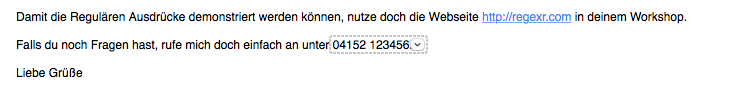
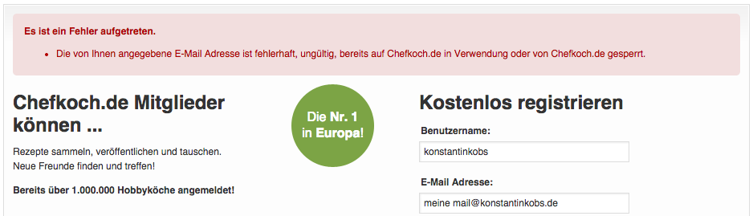

title: Reguläre Ausdrücke
author:
  name: Konstantin Kobs
  twitter: konstantinkobs
  url: http://kobs.it
output: index.html
controls: false
style: theme/style.css

--

# Reguläre Ausdrücke
## `/^Reg(exp?|ular expression)$/`

--

# Zu mir
## Konstantin Kobs

--

# Organisation

--

### Agenda

1. Was sind Reguläre Ausdrücke?
1. Syntax
1. Vorteile und Nachteile
1. Praktische Anwendungen
1. Wie funktionieren Reguläre Ausdrücke?
1. *Endliche Automaten und Reguläre Ausdrücke*

--

### Was sind Reguläre Ausdrücke?

> A way to describe a set of strings.
> 
> <small>- Lea Verou</small>

--

# Beispiele

--

### Informationen in Mails

--

### Mail Validierung auf Webseiten

--

### Code Highlighting

--

### Wo findet man sie noch?

- Compiler *(Quelltext in Tokens aufteilen)*
- *Suchen und Ersetzen* in Text Editoren/Open Office
- Autovervollständigung

--

### Was sind Reguläre Ausdrücke?

> Sie beschreiben eine Syntax und können
> überprüfen, ob diese Syntax in einem Text vorkommt
> oder erfüllt ist.

--

### Anwendungsfälle

1. Informationen aus Text herausfiltern
2. Text auf eine bestimmte Syntax hin überprüfen
3. Vorkommnisse suchen und ersetzen

--

`/^Reg(exp?|ular expression)$/`

Erkennt:
- "Regex"
- "Regexp"
- "Regular expression"

--

# Syntax

--

# [regexr.com](http://regexr.com)

--

### Pattern (1)

- Buchstaben und Zahlen matchen sich selbst
- Mehrere Möglichkeiten mit `|`
- Gruppen mit Klammern `( )`
- Geschweifte Klammern `{min,max}`
- Eckige Klammern `[ ]` wählen ein Zeichen daraus aus
- Ranges, zum Beispiel `[a-z]`
- Sonderzeichen müssen mit Backslash escaped werden

--

### Aufgabe 1a *(Telefonnummern)*

Schreiben Sie einen Regulären Ausdruck, der Telefonnummern in einem Text findet.

--

### Fragen beim Schreiben Regulärer Ausdrücke

1. Welche Zeichenketten sollen/sollen **nicht** gefunden werden?
1. Wie ist das zu findende Muster aufgebaut?
1. Kann man überhaupt den *perfekten* Ausdruck für diese Anwendung schreiben?
1. Muss der Ausdruck noch spezifischer werden...
1. oder reicht er im gegebenen Kontext aus?

--

### Pattern (2)

- `.` matcht jedes Zeichen *(bis auf neue Zeilen)*
- `+ = {1,}`, `* = {0,}` und `? = {0,1}`
- `[^a]` bedeutet: Jedes Zeichen außer `a`
- `^` und `$` bezeichnen den Anfang und das Ende der Zeichenkette
- `\d = [0-9]`; `\D = [^\d]`
- `\w = [a-zA-Z0-9]`; `\W = [^\w]`
- `\s` sind Leerräume und neue Zeilen; `\S` Gegenteil
- Mit `\b` stellt man Wortanfänge und -enden dar

--

### Aufgabe 1b *(Telefonnummern)*

Vereinfachen und verbessern Sie den Regulären Ausdruck mit den eben gelernten Abkürzungen.

--

### Flags

- `g` *(global)*: Sucht alle Vorkommnisse
- `i` *(ignore case)*: Nicht mehr auf Groß- und Kleinschreibung achten
- `m` *(multiline)*: `^` und `$` beziehen sich nicht auf den Anfang und das Ende des **Strings**, sondern jeder **Zeile**.

--

### Aufgabe 2 *(Durch 20 teilbar)*

Schreiben Sie einen Regulären Ausdruck, der eine Zahl auf die Teilbarkeit mit 20 prüft.

--

### Backreference

> Auf Teile der gefundenen Zeichenkette zurückgreifen

`\1` innerhalb eines Ausdruckes

`$1` beim Ersetzen

--

### Aufgabe 3 *(Internet-Adressen)*

Schreiben Sie einen Regulären Ausdruck, der in einem Text Internet-Adressen findet und durch einen Link auf diese Seite ersetzt.

--

### Aufgabe 4 *(Datumsangaben)*

Schreiben Sie einen Regulären Ausdruck, der alle Datumsangaben im Abschnitt *"Mauerfall"* des deutschen Wikipedia-Artikels *"Berliner Mauer"* findet.

--

### Aufgabe 5 *(Registrierung mit Mail-Adresse)*

Schreiben Sie einen Regulären Ausdruck, der überprüft, ob eine Mail-Adresse eine gültige Syntax hat.

--

### Aufgabe 6 *(IP Adressen)*

Schreiben Sie einen Regulären Ausdruck, der eine IPv4 Adresse auf seine Syntax überprüft.

**Beispiel:** `192.168.0.1`

--

### Greedy und Lazy *(Gierig und Genügsam)*

- `+` und `*` sind greedy
- `+?` und `*?` sind lazy

--

# Vorteile und Nachteile

--

### Vorteile

- Schnell änderbar
- Universell
- In vielen Programmiersprachen Standard

--

### Nachteile

- Leicht unübersichtlich
- Schnell fehlerhafte Übereinstimmungen *(false positives)*
- Langsam durch *Backtracking*

--

# Wie funktioniert's?

--

### Backtracking

> Wie findet der Computer überhaupt alle Vorkommnisse des Ausdruckes?

*Beispiel:* `/a+aab/`

--

### Abschlussprojekt: Markdown

- Text zu HTML
- Für Menschen einfach zu lesen
- Leichte Syntax

--

`# Überschrift`

`## Zweite Überschrift`

`*Kursiv*` > *Kursiv*

`**Fett**` > **Fett**

`[Link](http://google.de)` > [Link](http://google.de)

`` > 

--

# Endliche Automaten

--

### Links

- [RegEx Crosswords](http://www.regexcrosswords.com/)
- [Common RegEx JS](https://github.com/talyssonoc/CommonRegexJS)
- [Demystifying Regular Expressions](https://www.youtube.com/watch?v=EkluES9Rvak)
- [JavaScript RegEx Referenz](https://developer.mozilla.org/de/docs/Web/JavaScript/Reference/Global_Objects/RegExp)